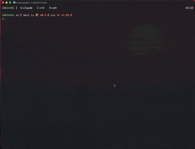

# ikkinchi

your second brain, a zero-friction CLI for capturing and retrieving thoughts.

> **Status: In Development**

*ikkinchi* means "second" in Uyghur



Thoughts are stored as plain markdown files in `~/.ikkinchi/memories/`.

Search is hybrid: semantic via Ollama embeddings + fuzzy matching. No folders, no cloud.

## Install

```bash
cargo install ikkinchi
```

## Setup

ikkinchi uses [Ollama](https://ollama.com) for local embeddings — no API key, no data leaving your machine.

Embeddings are powered by [Rig](https://github.com/0xPlaygrounds/rig), a Rust library for building LLM-powered applications.

```bash
# 1. Install Ollama
brew install ollama        # macOS
# or https://ollama.com/download

# 2. Pull the embedding model
ollama pull nomic-embed-text

# 3. Start Ollama (runs in background)
ollama serve

# 4. Initialize ikkinchi
ikkinchi init
```

## How it works

**Capture thoughts instantly:**

```bash
ikkinchi add "what do fish think about all day?"
ikkinchi add "learned how the borrow checker works" --tag rust --tag til
ikkinchi add "There is a @swc/react-compiler package but no documentation"
```

Each thought is appended to a daily markdown file (`~/.ikkinchi/memories/2026-03-10.md`). In the background, Rig calls Ollama to embed the text into a 768-dimension vector, which is persisted in a local SQLite store (`~/.ikkinchi/vectors.db`).

**Search semantically — not just by keyword:**

```bash
$ ikkinchi search "work"
  1  2026-03-10/19:54:08  There is a @swc/react-compiler package but no documentation
  ...
```

At search time, Rig embeds your query using the same Ollama model and computes cosine similarity against all stored vectors. Results are blended with fuzzy text matching (0.6 × semantic + 0.4 × fuzzy). If Ollama is unavailable, search falls back to fuzzy-only automatically.

**Browse and manage:**

```bash
ikkinchi tui               # open interactive terminal UI
ikkinchi list              # newest first, with tags shown
ikkinchi list --tag rust   # filter by tag
ikkinchi edit <id> <text>  # update a thought (re-embeds automatically)
ikkinchi delete <id>       # remove a thought
ikkinchi stats             # memory count, date range, vector count, tag count
```

**Manage tags:**

```bash
ikkinchi tags                          # list all tags with counts
ikkinchi tag add <id> rust til         # add tags to a memory
ikkinchi tag remove <id> til           # remove a tag
```

**Rebuild the vector index:**

```bash
ikkinchi reindex           # re-embed all memories (useful after import or model change)
```

**Import existing notes:**

```bash
ikkinchi import notes.md          # one chunk per paragraph
ikkinchi import ~/notes/          # all .md and .txt files in a directory
```

## Storage

Everything lives in `~/.ikkinchi/`:

```
~/.ikkinchi/
  config.toml          # model, embedding settings
  memories/
    2026-03-10.md      # plain markdown, one file per day
    2026-03-11.md
  vectors.db           # SQLite, local embedding vectors (Rig + nomic-embed-text)
```

You can read, edit, or back up your memories directly — they're just markdown.

## Under the hood

- **[Rig](https://github.com/0xPlaygrounds/rig)** — Rust LLM framework, handles all Ollama communication and embedding calls
- **[Ollama](https://ollama.com)** — runs `nomic-embed-text` locally, no internet required
- **SQLite** (via `sqlx`) — persists embedding vectors as raw binary blobs
- **fuzzy-matcher** — `SkimMatcherV2` for fuzzy text scoring, blended with semantic results
- **Plain markdown** — memories are human-readable files, not a proprietary database

## Commands

```
ikkinchi init                          Set up ~/.ikkinchi/, create config
ikkinchi add <text> [--tag <tag>]...   Capture a thought, optionally tagged
ikkinchi search <query> [--tag <tag>]  Semantic + fuzzy hybrid search
ikkinchi tui                           Launch interactive terminal UI
ikkinchi list [--count N] [--tag <tag>] Browse recent memories
ikkinchi edit <id> <text>              Update a memory
ikkinchi delete <id>...                Delete one or more memories
ikkinchi tags                          List all tags with counts
ikkinchi tag add <id> <tag>...         Add tags to a memory
ikkinchi tag remove <id> <tag>...      Remove tags from a memory
ikkinchi import <path>                 Import .md/.txt files
ikkinchi export [--format json|markdown]  Export all memories
ikkinchi reindex                       Rebuild vector index from markdown files
ikkinchi stats                         Show memory, vector, and tag counts
```

Run `ikkinchi --help` for details on any command.

## Configuration

`~/.ikkinchi/config.toml` (created by `ikkinchi init`):

```toml
[embedding]
provider = "ollama"
model = "nomic-embed-text"
url = "http://localhost:11434"
ndims = 768

[display]
list_count = 20
```
